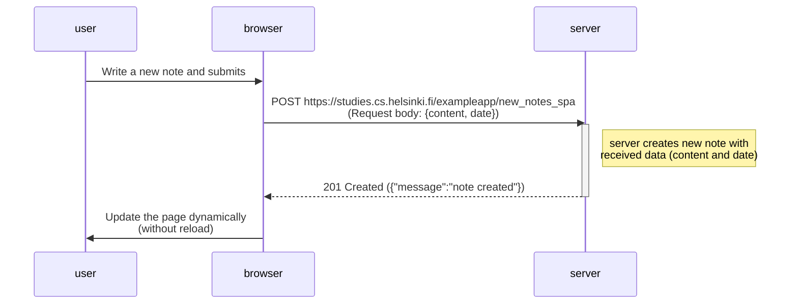

```mermaid
sequenceDiagram
  participant user
  participant browser
  participant server

  user->>browser: Write a new note and submits
  browser->>server: POST https://studies.cs.helsinki.fi/exampleapp/new_notes_spa<br>(Request body: {content, date})
  activate server
  Note right of server: server creates new note with<br>received data (content and date)
  server-->>browser: 201 Created ({"message":"note created"})
  deactivate server
  browser->>user: Update the page dynamically<br>(without reload)
```
